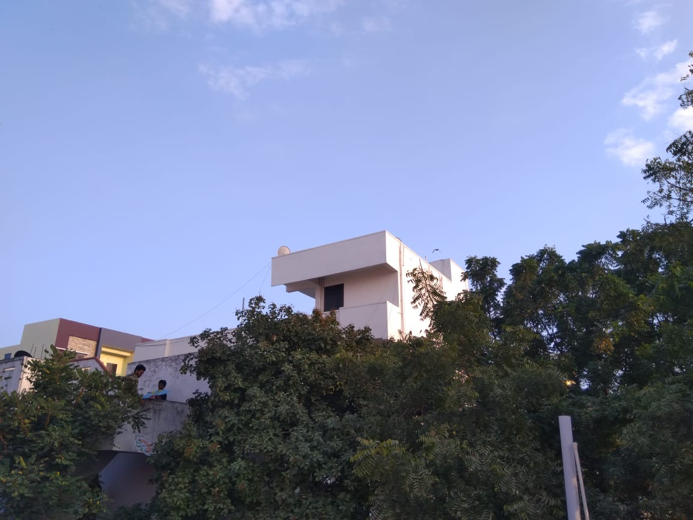
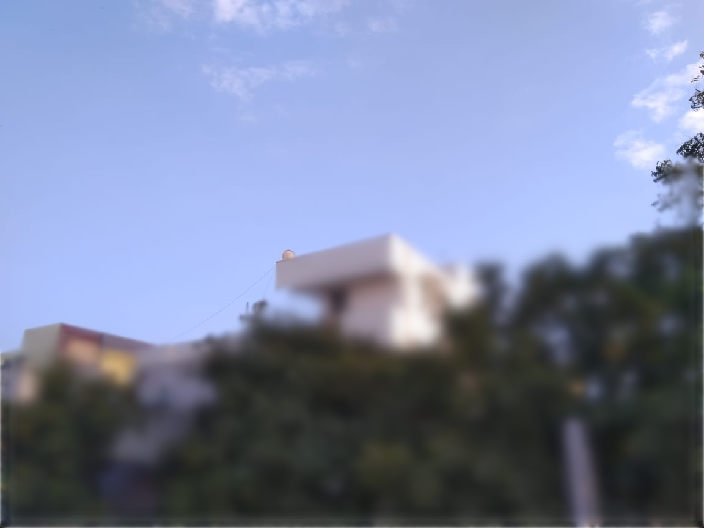

# Sky Region AI Inference Server on Flask

  SkyRegion is an Image Segmentation Model, created by fine-tuning Mask R-CNN, which generates a mask for a given image. This repo is the Inference Server that can be used by Web Apps or Mobile Apps.

  * ### Example Input:
    

  * ### Output and Composite Image:
     &nbsp;&nbsp;&nbsp;
    
       

    Composite generated by applying a blur effect using the mask. This makes it easier for the user to understand what's happening.

  * Server IP: `<your-computer-ip>:8001`

  * ## Installation
    
    * Install required packages  
      `pip3 install -r requirements.txt`

    * Download models  
      `python3 download_models.py`

    * Run Server  
      `python3 app.py`

  * ## Installation (Docker) (Recommended)

    * To Build:  
      `docker build -t sky-region -f docker/Dockerfile .`
    
    * To Run: 
      `docker run -d --rm -p 8001:8000 --name sky-region sky-region`
